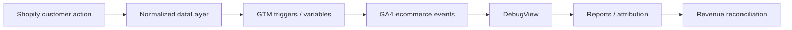

# GA4 + GTM + Shopify Ecommerce Tracking

> **A clean ecommerce event contract for GA4/GTM with sequence and payload validation.**

[](https://github.com/beltebaiken-star/shopify-ga4-gtm-ecommerce)
[](https://github.com/beltebaiken-star/shopify-ga4-gtm-ecommerce/actions/workflows/demo-check.yml)
[](https://www.upwork.com/freelancers/baikenbelte)

## Client problem

Analytics setups become unreliable when theme code, apps and GTM all emit overlapping or inconsistent ecommerce events.

## What this project proves

This project demonstrates a single normalized event model for view_item, add_to_cart, begin_checkout and purchase, plus a runnable test of event order and required ecommerce payload fields.

## Architecture



## Quick start

```bash
git clone https://github.com/beltebaiken-star/shopify-ga4-gtm-ecommerce.git
cd shopify-ga4-gtm-ecommerce
npm test
```

**What the demo checks:** Validates the ecommerce funnel sequence and ensures currency, item arrays and purchase transaction ID are present.

No external credentials or paid services are required for this demo.

## What I would deliver on a client project

- GA4/GTM implementation audit
- dataLayer event contract
- GTM tags/triggers/variables mapping
- DebugView QA
- Funnel event validation
- Purchase/revenue reconciliation checklist

## Production QA principles

- Diagnose the failing layer before changing production code.
- Keep identifiers, values and platform mappings consistent end-to-end.
- Test both success and failure paths.
- Check for duplicates, missing events/data, and stale configuration.
- Reconcile platform output against Shopify/store source-of-truth data.
- Document the fix and leave a repeatable verification checklist.

## Repository map

```text
demo/                 runnable synthetic validation
examples/             safe sample payloads / implementation snippets
docs/architecture.md  technical architecture notes
docs/qa-checklist.md  production verification checklist
README.md              client-facing case study
```

## Security & portfolio note

This repository is a **sanitized technical portfolio demo**. It intentionally excludes customer data, production credentials, private URLs, access tokens and proprietary client code.

## Hire / contact

I take on focused Shopify, ecommerce tracking, analytics, GMC and integration projects.

**Upwork:** https://www.upwork.com/freelancers/baikenbelte
